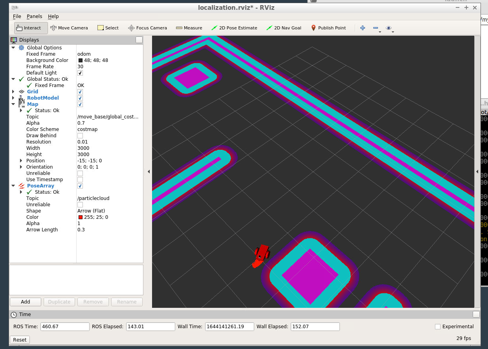
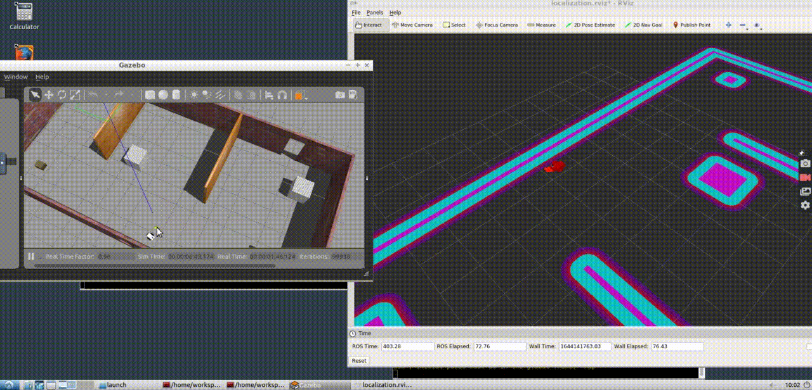
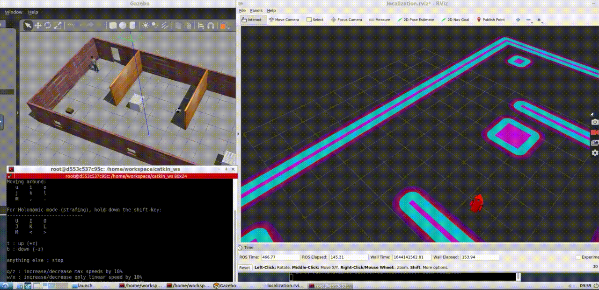

### System Dependencies
- Ubuntu 16.04
- ROS Kinetic
- Gazebo
- Turtlebot Packages

### Steps to launch the simulation

#### Update and upgrade the Workspace image
```
sudo apt-get update
sudo apt-get upgrade -y
```
#### Clone the lab folder in /home/workspace/
```
cd /home/workspace/
git clone https://github.com/sahilshembekar/Obstacle-Avoidance-Project.git
```
#### Launch the simulation
```
cd /home/workspace/Project/catkin_ws
source devel/setup.bash
roslaunch my_robot world.launch
```

#### Launch amcl launch file
```
cd /home/workspace/Project/catkin_ws
source devel/setup.bash
roslaunch my_robot amcl.launch
```
#### Testing

##### Option 1: Send 2D Navigation Goal from RViz
Click the 2D Nav Goal button in the toolbar, then click and drag on the map to send the goal to the robot. It will start moving and localize itself in the process and also stop when it comes across an obstacle.

##### Option 2: Use teleop node
```
cd /home/workspace/Where-Am-I/catkin_ws
source devel/setup.bash
rosrun teleop_twist_keyboard teleop_twist_keyboard.py
```
Now, you can control the robot by keyboard commands.

### Result


### Demo Videos

#### Demo with Control-Using-2D-Nav-Goal


#### Demo with Control-using-teleop-keyboard 
